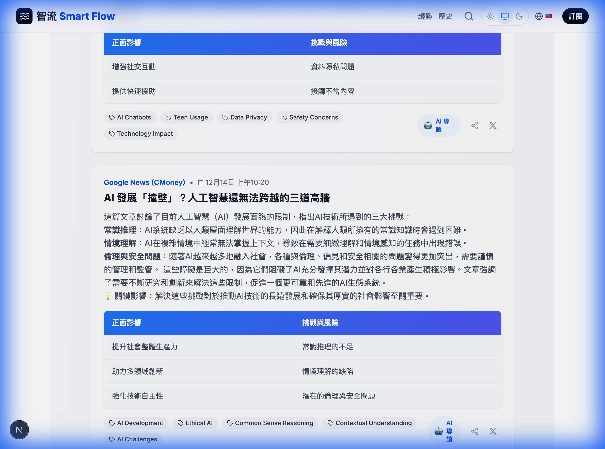

# ✨ 新手指南：如何使用《智流》掌握每日科技趨勢

歡迎來到《智流》！這是一個專為忙碌現代人設計的 AI 科技新聞站。
即使您不懂複雜的 AI 術語，也能像讀報紙一樣，輕鬆掌握世界脈動。

以下是我們的功能介紹：

---

## 1. 首頁：三步驟輕鬆上手

一進入網站，您會看到這個歡迎區塊。不用擔心不知道按哪裡，跟著畫面上的 1-2-3 步驟做就好：
1.  **打開網站**
2.  **往下滑**
3.  **點標題看原文，點內容進去閱讀**

---

## 2. 瀏覽最新動態

往下滑動，您會看到最新的全球新聞摘要。
我們已經幫您把落落長的英文新聞，整理成 **中文標題** 與 **簡短摘要**。

*   **來源標示**：這則新聞來自哪裡 (如 TechCrunch, Google News)。
*   **關鍵字標籤**：快速了解這篇新聞在講什麼 (如 #Apple, #OpenAI)。

---

## 3. 聆聽與互動 (AI 導讀)

點進任何一則新聞，您會看到這兩個強大功能：

1.  **🎧 聆聽 AI 導讀**：按下藍色的播放鍵，AI 會用自然的語音唸新聞給您聽。適合開車、做家事時使用。
2.  **💬 AI 導讀助手**：右下角 (或下方) 有一個對話視窗。如果您覺得新聞太難懂，可以直接問它：「這跟一般人有什麼關係？」或是「請用白話文解釋」。

---

## 4. 每日送到家 (免費訂閱)

如果您覺得每天自己開網站很麻煩，可以滑到最下方。
只要輸入您的 Email，我們每天早上 8 點會準時把 **「今日重點摘要」** 寄到您的信箱。

完全免費，而且我們保證不會寄送垃圾信件。

---

### 常見問題

*   **需要註冊帳號嗎？**
    *   不需要！打開網站就能直接看。
*   **可以用手機看嗎？**
    *   可以！我們的網站專為手機設計，甚至可以加入主畫面變成 App。

希望您喜歡《智流》帶來的便捷閱讀體驗！
